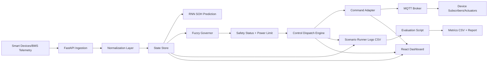

# Evaluation Framework and Architecture

## 1) Evaluation Metrics

### 1. Peak Temperature Reduction (%)
- Purpose: quantify thermal safety improvement under control.
- Formula:
  - `PeakTempReduction% = ((PeakTemp_baseline - PeakTemp_controlled) / PeakTemp_baseline) * 100`
- Recommended baseline:
  - same scenario with safety dispatch disabled or prior baseline run.

### 2. SOH Degradation Rate (per hour)
- Purpose: quantify battery aging speed.
- Formula:
  - `SOHDegradationRate = (SOH_start - SOH_end) / duration_hours`
- Lower is better.

### 3. Number of Protection Events
- Purpose: count how often system enters unsafe state.
- Definition:
  - count transitions `OPTIMAL -> PROTECTED` in status timeline.

### 4. Energy Cost Index
- Purpose: proxy for energy cost during each scenario.
- Formula (hourly price weighted):
  - `EnergyCostIndex = sum(appliance_total_kw * grid_price(hour))`
- Lower is better, subject to safety constraints.

### 5. User Comfort Impact (Load Curtailment Count)
- Purpose: measure service impact on appliances.
- Definition:
  - total `turn_off` commands issued by dispatch.
- Lower means less user impact (while maintaining safety).

## 2) Logging and Dataset Pipeline

Use `scripts/run_test_scenarios.ps1`:
- generates structured scenarios,
- records per-step rows into CSV with:
  - telemetry (`load_a`, `temp_c`, `source`, `telemetry_fresh`),
  - predictions/control (`health`, `fuzzy_limit`, `status`),
  - actions/dispatch (`dispatch_commands`, `turn_off_commands`),
  - derived load (`appliance_total_kw`).

Then use `scripts/evaluate_scenarios.py`:
- computes all KPIs,
- exports:
  - `metrics_summary.csv`
  - `evaluation_report.md`.

Output location:
- `data/eval/<run_id>/`.

## 3) Structured Test Scenarios

1. Normal Load
- SIM mode, normal scenario, medium load.

2. Heatwave / High Temperature
- SIM mode, heatwave scenario.

3. Sudden Load Spike
- LIVE mode telemetry with low->high->low current profile.

4. Missing / Stale Telemetry
- LIVE mode with initial telemetry, then no further telemetry to validate fallback.

## 4) Validation Targets

- Safety behavior:
  - PROTECTED mode triggers when thermal/health risk rises.
  - `fuzzy_limit` drops in unsafe conditions.
- Fallback logic:
  - LIVE mode should switch source to SIM when telemetry becomes stale.
- Closed-loop control:
  - dispatch issues curtailment commands under protection.

## 5) Architecture Diagram

