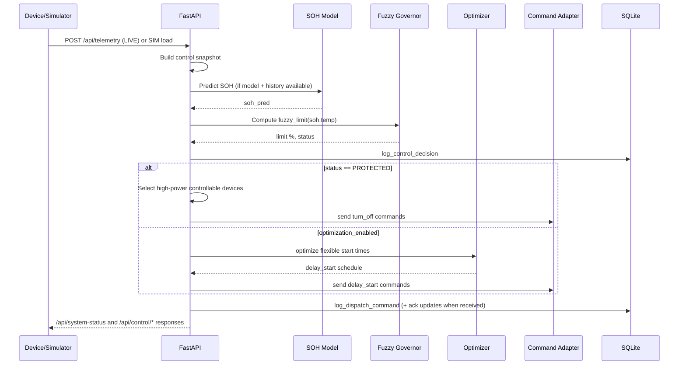
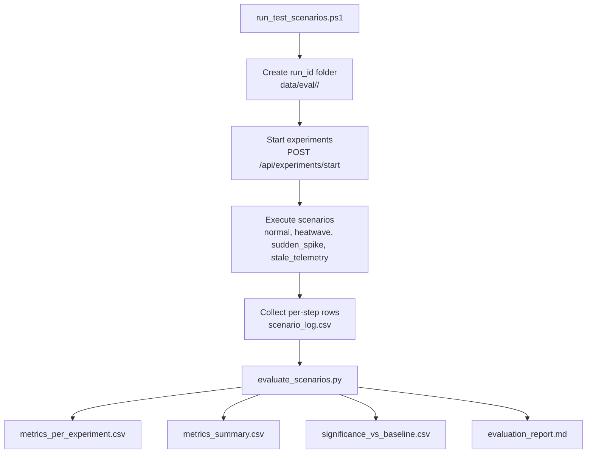
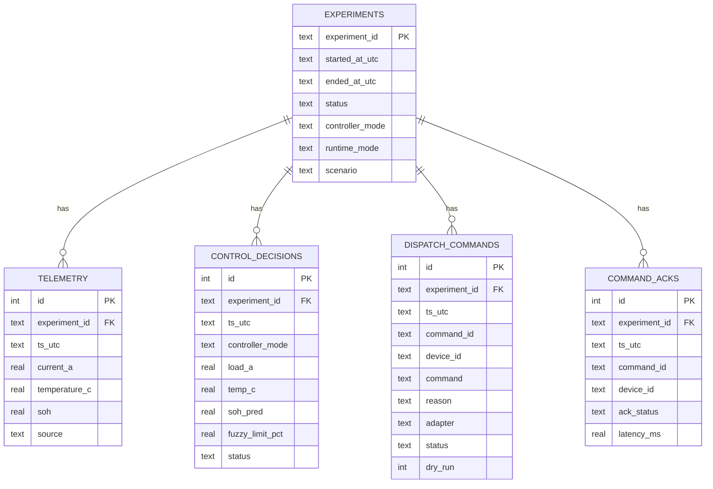

# Battery Project Overview

## What This Project Does
Adaptive battery management prototype for smart homes. It combines simulation/telemetry ingestion, SOH prediction, fuzzy safety governance, and optional schedule optimization to keep battery operation safe while reducing cost and user impact.

## Tech Stack
- Backend API: FastAPI (`backend/main.py`)
- Persistence: SQLite (`backend/persistence.py`, default `data/ops/battery_ops.db`)
- AI/Control: TensorFlow LSTM SOH model, scikit-fuzzy governor, GA-based scheduling (`src/`)
- Frontend: React + Vite dashboard (`frontend/`)
- Evaluation: PowerShell scenario runner + Python KPI/statistics scripts (`scripts/`)

## System Architecture
```mermaid
flowchart LR
    UI[React Dashboard\nfrontend/src/App.jsx] --> API[FastAPI Backend\nbackend/main.py]
    Devices[Device Telemetry\n/api/telemetry + /api/devices/*] --> API

    API --> Control[Control Snapshot Engine\n_predict_soh + fuzzy limit + mode fallback]
    API --> Dispatch[Dispatch Engine\nSafety override + optimization]
    Dispatch --> Adapter[Command Adapter\nmock | mqtt]
    Adapter --> Broker[MQTT Broker / Device Endpoints]

    API --> DB[(SQLite\ndata/ops/battery_ops.db)]
    Control --> DB
    Dispatch --> DB

    API --> Model[(SOH Model\nmodels/fatigue_model.h5)]
    API --> Gov[Fuzzy Governor\nsrc/fuzzy_governor.py]
    API --> GA[GA Optimizer\nsrc/ga_optimizer.py]
```

## Runtime Control Sequence


## Evaluation and Reporting Pipeline


## Persistence Model


## Key API Surface
- Runtime and control:
  - `GET /api/system-status`
  - `POST /api/control/dispatch`
  - `POST /api/control/mode`
  - `POST /api/mode`
  - `POST /api/set-scenario`
- Telemetry and devices:
  - `POST /api/telemetry`
  - `POST /api/devices/telemetry`
  - `POST /api/devices/ingest-raw`
  - `GET /api/devices`
- Experiments and reliability:
  - `POST /api/experiments/start`
  - `POST /api/experiments/end`
  - `GET /api/experiments/current`
  - `POST /api/control/ack`
  - `GET /api/control/metrics`

## Typical Workflows
1. Start backend:
```bash
uvicorn backend.main:app --reload --host 0.0.0.0 --port 8000
```
2. Start frontend:
```bash
cd frontend
npm install
npm run dev
```
3. Optional model generation/training:
```bash
python src/battery_sim.py
python src/rnn_prognostic.py
```
4. Scenario evaluation:
```powershell
powershell -ExecutionPolicy Bypass -File .\scripts\run_test_scenarios.ps1 -Repeats 5
python .\scripts\evaluate_scenarios.py
```
5. SOH validation:
```bash
python .\scripts\validate_soh_model.py --data .\data\battery_history.csv --model .\models\fatigue_model.h5
```
